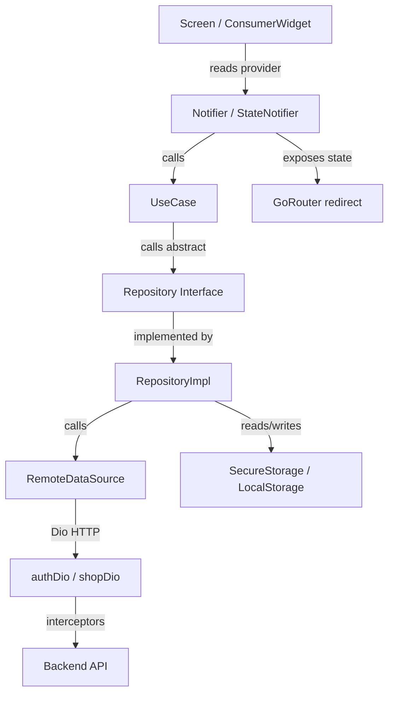
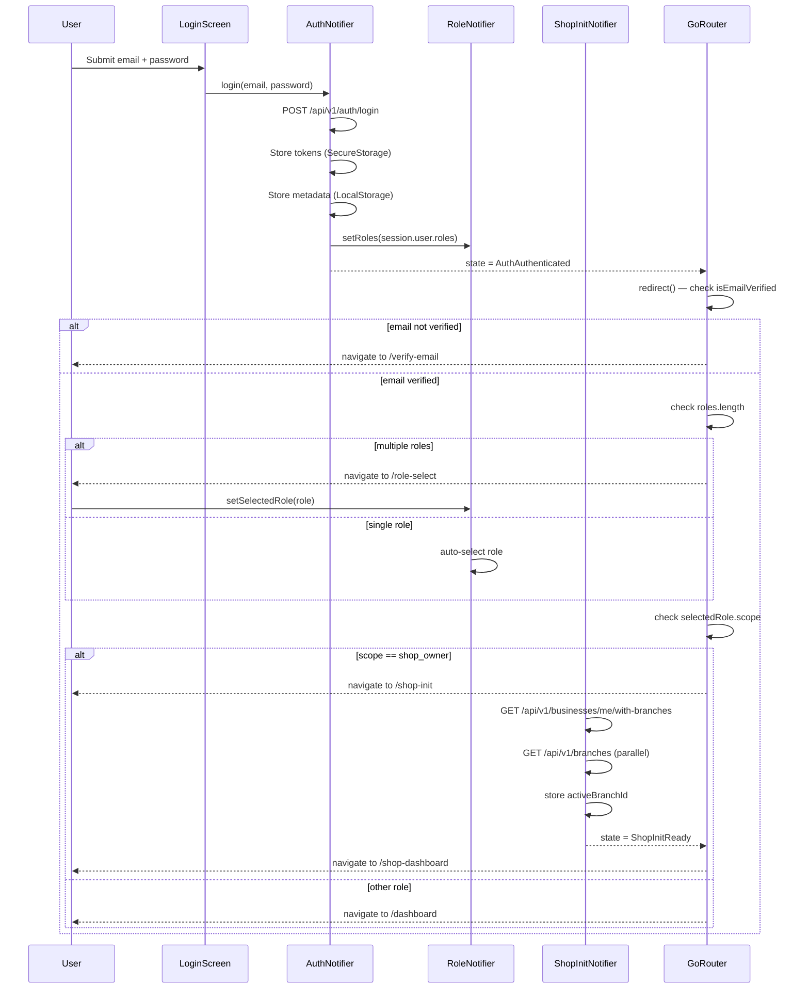
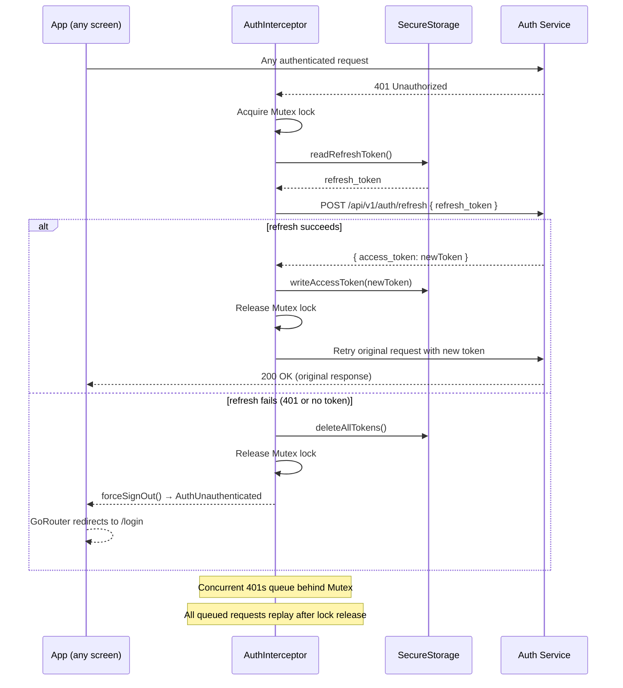
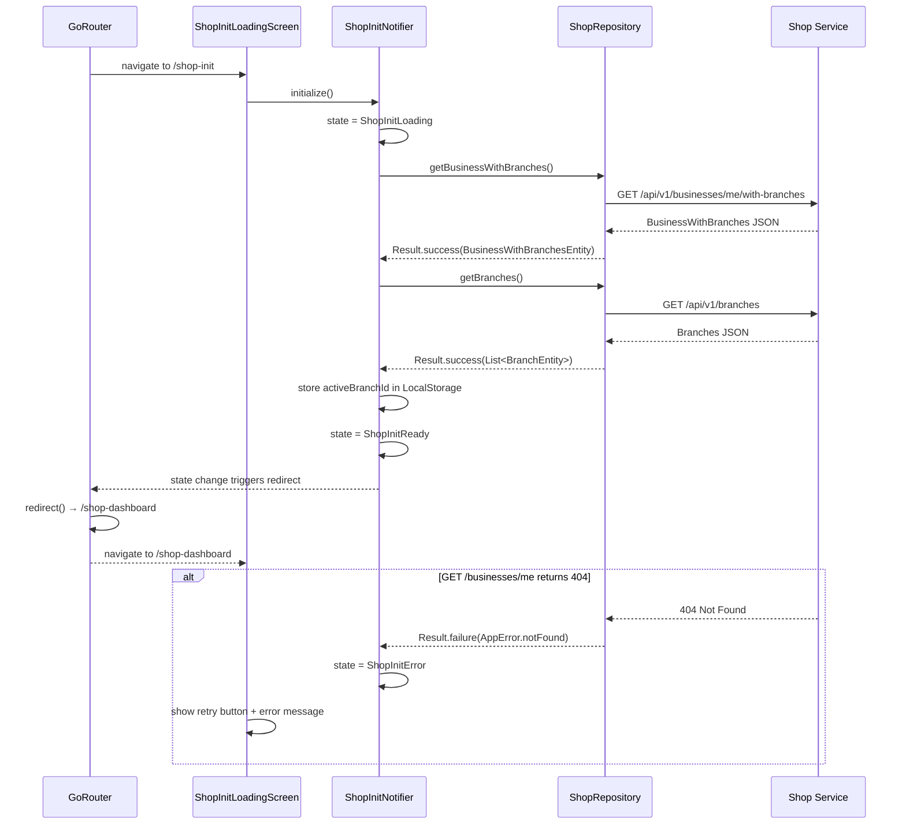

# Design Document

## Zoovana Auth, RBAC, Tenant & Shop Init — Flutter Feature

---

## Overview

This document covers the design for four tightly coupled Flutter mobile flows in the Zoovana CMS app:

1. **Authentication** — Login, registration, email verification, and password reset against the Auth Service (port 8001), with JWT storage in `flutter_secure_storage`, proactive + reactive token refresh, and a Dio interceptor chain.
2. **Role-Based Access Control (RBAC)** — Parsing and persisting the `roles` array and `is_superuser` flag from the login response, enforcing role-based navigation guards via GoRouter.
3. **Tenant & Approval Flow** — Storing `default_tenant_id`, detecting pending-approval state, and routing to the correct screen.
4. **Shop Owner Initialization** — Post-login data loading for shop owners: fetching business and branches from the Shop Service (port 8012), then routing to the shop dashboard.

The implementation follows Clean Architecture with three layers:

```
Presentation (Notifiers, Screens)
    ↓ calls
Domain (Use Cases, Entities, Repository Interfaces)
    ↓ calls
Data (Repository Impls, Models, Remote Data Sources, Interceptors)
    ↓ HTTP
Backend APIs (Auth Service :8001, Shop Service :8012)
```

State management uses **Riverpod** (`flutter_riverpod`). Navigation uses **GoRouter** with redirect guards that read `AuthState`, `RoleStore`, and `ShopInitState`. Dependency injection uses **get_it** as the service locator.

---

## Architecture

### Layered Data Flow



### Folder Structure

```
lib/
├── main.dart                                  # WidgetsFlutterBinding + DI.init() + runApp
├── app.dart                                   # ProviderScope + MaterialApp.router(goRouter)
│
├── core/
│   ├── config/
│   │   └── app_config.dart                    # Base URLs, timeouts, env constants
│   │
│   ├── network/
│   │   ├── dio_factory.dart                   # Creates authDio and shopDio instances
│   │   ├── api_endpoints.dart                 # All URL path constants
│   │   └── interceptors/
│   │       ├── locale_interceptor.dart        # Injects Accept-Language header
│   │       ├── logger_interceptor.dart        # Logs requests/responses in debug
│   │       ├── error_interceptor.dart         # DioException → AppError
│   │       └── auth_interceptor.dart          # Token injection + 401 refresh + retry
│   │
│   ├── error/
│   │   ├── app_error.dart                     # AppError with boolean flags
│   │   └── result.dart                        # Result<T> sealed class
│   │
│   ├── storage/
│   │   ├── secure_storage_service.dart        # flutter_secure_storage wrapper
│   │   └── local_storage_service.dart         # shared_preferences wrapper
│   │
│   ├── utils/
│   │   ├── jwt_utils.dart                     # Decode JWT expiry without verification
│   │   └── app_logger.dart                    # Logger wrapper
│   │
│   └── di/
│       └── dependency_injection.dart          # get_it registrations
│
├── features/
│   ├── auth/
│   │   ├── data/
│   │   │   ├── models/
│   │   │   │   ├── login_request_model.dart
│   │   │   │   ├── login_response_model.dart
│   │   │   │   ├── user_model.dart
│   │   │   │   └── role_model.dart
│   │   │   ├── datasources/
│   │   │   │   └── auth_remote_datasource.dart
│   │   │   └── repositories/
│   │   │       └── auth_repository_impl.dart
│   │   │
│   │   ├── domain/
│   │   │   ├── entities/
│   │   │   │   ├── auth_session_entity.dart
│   │   │   │   ├── user_entity.dart
│   │   │   │   └── role_entity.dart
│   │   │   ├── repositories/
│   │   │   │   └── auth_repository.dart       # Abstract interface
│   │   │   └── usecases/
│   │   │       ├── login_usecase.dart
│   │   │       ├── register_usecase.dart
│   │   │       ├── verify_email_usecase.dart
│   │   │       ├── forgot_password_usecase.dart
│   │   │       ├── reset_password_usecase.dart
│   │   │       ├── logout_usecase.dart
│   │   │       └── refresh_token_usecase.dart
│   │   │
│   │   └── presentation/
│   │       ├── notifiers/
│   │       │   ├── auth_notifier.dart         # AuthState sealed class + AuthNotifier
│   │       │   └── role_notifier.dart         # RoleState + RoleNotifier
│   │       └── screens/
│   │           ├── login_screen.dart
│   │           ├── register_screen.dart
│   │           ├── verify_email_screen.dart
│   │           ├── forgot_password_screen.dart
│   │           ├── reset_password_screen.dart
│   │           └── pending_approval_screen.dart
│   │
│   └── shop/
│       ├── data/
│       │   ├── models/
│       │   │   ├── business_model.dart
│       │   │   ├── branch_model.dart
│       │   │   └── business_with_branches_model.dart
│       │   ├── datasources/
│       │   │   └── shop_remote_datasource.dart
│       │   └── repositories/
│       │       └── shop_repository_impl.dart
│       │
│       ├── domain/
│       │   ├── entities/
│       │   │   ├── business_entity.dart
│       │   │   ├── branch_entity.dart
│       │   │   └── business_with_branches_entity.dart
│       │   ├── repositories/
│       │   │   └── shop_repository.dart       # Abstract interface
│       │   └── usecases/
│       │       └── shop_init_usecase.dart
│       │
│       └── presentation/
│           ├── notifiers/
│           │   └── shop_init_notifier.dart    # ShopInitState sealed class + ShopInitNotifier
│           └── screens/
│               ├── role_select_screen.dart
│               └── shop_init_loading_screen.dart
│
└── routes/
    ├── app_router.dart                        # GoRouter instance with redirect logic
    └── app_routes.dart                        # Named route constants
```

### Key Architectural Decisions

**Decision 1: Riverpod over GetX for this feature set**
The existing CMS architecture uses GetX. This feature spec explicitly requires Riverpod (`flutter_riverpod`). Riverpod's compile-time safety, `AsyncNotifier`, and `ref.watch` / `ref.listen` patterns are a better fit for the reactive auth state machine described in the requirements. The two can coexist in the same app — GetX handles existing features, Riverpod handles auth/RBAC/shop-init.

**Decision 2: Sealed classes for AuthState and ShopInitState**
Dart 3 sealed classes enforce exhaustive pattern matching at compile time. Every screen that reads `AuthState` must handle all variants (`loading`, `unauthenticated`, `authenticated`, `pendingApproval`), preventing silent bugs from unhandled states.

**Decision 3: Two Dio instances (authDio, shopDio)**
Auth Service and Shop Service have different base URLs and may have different auth requirements in the future. Separate instances allow independent interceptor configuration and prevent cross-service token leakage.

**Decision 4: Mutex for token refresh**
The `synchronized` package's `Lock` (Mutex) ensures that when multiple concurrent requests receive a 401, only one refresh call is made. All other requests queue behind the lock and replay with the new token once the refresh completes.

**Decision 5: Proactive + reactive token refresh**
Proactive refresh (within 10 minutes of expiry) prevents mid-request 401s for most cases. Reactive refresh (Auth_Interceptor on 401) handles edge cases where the proactive check was missed or the token was invalidated server-side.

**Decision 6: GoRouter redirect reads Riverpod state synchronously**
GoRouter's `redirect` callback is synchronous. The `AuthNotifier`, `RoleNotifier`, and `ShopInitNotifier` expose their current state as synchronously readable values. The redirect callback reads these values directly without `await`.


---

## Components and Interfaces

### AppError

`AppError` is the single typed error object used throughout the app instead of raw HTTP status codes or `DioException`.

```dart
// core/error/app_error.dart

class AppError {
  final int status;
  final String message;
  final Map<String, List<String>>? errors; // field-level validation errors

  // Status flags — exactly one is true per error instance
  final bool badRequest;       // 400
  final bool unauthorized;     // 401
  final bool forbidden;        // 403
  final bool notFound;         // 404
  final bool conflict;         // 409
  final bool validationErrors; // 422
  final bool serverError;      // 500
  final bool networkError;     // no response / DNS failure
  final bool cancelled;        // request cancelled

  const AppError({
    required this.status,
    required this.message,
    this.errors,
    this.badRequest = false,
    this.unauthorized = false,
    this.forbidden = false,
    this.notFound = false,
    this.conflict = false,
    this.validationErrors = false,
    this.serverError = false,
    this.networkError = false,
    this.cancelled = false,
  });

  // Named constructors for each error type
  factory AppError.badRequest(String message, {Map<String, List<String>>? errors}) =>
      AppError(status: 400, message: message, errors: errors, badRequest: true);

  factory AppError.unauthorized([String message = 'Session expired']) =>
      AppError(status: 401, message: message, unauthorized: true);

  factory AppError.forbidden([String message = "You don't have permission"]) =>
      AppError(status: 403, message: message, forbidden: true);

  factory AppError.notFound([String message = 'Resource not found']) =>
      AppError(status: 404, message: message, notFound: true);

  factory AppError.conflict(String message) =>
      AppError(status: 409, message: message, conflict: true);

  factory AppError.validationError(String message, Map<String, List<String>> errors) =>
      AppError(status: 422, message: message, errors: errors, validationErrors: true);

  factory AppError.serverError([String message = 'An unexpected server error occurred']) =>
      AppError(status: 500, message: message, serverError: true);

  factory AppError.network([String message = 'No internet connection. Please check your network.']) =>
      AppError(status: 0, message: message, networkError: true);

  factory AppError.cancelled() =>
      AppError(status: 0, message: 'Request cancelled', cancelled: true);
}
```

### Result\<T\>

```dart
// core/error/result.dart

sealed class Result<T> {
  const Result();
}

final class Success<T> extends Result<T> {
  final T data;
  const Success(this.data);
}

final class Failure<T> extends Result<T> {
  final AppError error;
  const Failure(this.error);
}

extension ResultExtension<T> on Result<T> {
  bool get isSuccess => this is Success<T>;
  bool get isFailure => this is Failure<T>;

  T? get data => switch (this) {
    Success<T> s => s.data,
    Failure<T> _ => null,
  };

  AppError? get error => switch (this) {
    Success<T> _ => null,
    Failure<T> f => f.error,
  };

  R when<R>({
    required R Function(T data) success,
    required R Function(AppError error) failure,
  }) => switch (this) {
    Success<T> s => success(s.data),
    Failure<T> f => failure(f.error),
  };
}
```

### Dio Factory

```dart
// core/network/dio_factory.dart

class DioFactory {
  static Dio createAuthDio({
    required SecureStorageService secureStorage,
    required LocalStorageService localStorage,
  }) {
    final dio = Dio(BaseOptions(
      baseUrl: AppConfig.authBaseUrl,   // http://161.35.222.194:8001
      connectTimeout: const Duration(seconds: 30),
      receiveTimeout: const Duration(seconds: 30),
      headers: {
        'Content-Type': 'application/json',
        'Accept': 'application/json',
      },
    ));

    dio.interceptors.addAll([
      LocaleInterceptor(),
      LoggerInterceptor(),
      ErrorInterceptor(),
      AuthInterceptor(dio: dio, secureStorage: secureStorage, localStorage: localStorage),
    ]);

    return dio;
  }

  static Dio createShopDio({
    required SecureStorageService secureStorage,
    required LocalStorageService localStorage,
  }) {
    final dio = Dio(BaseOptions(
      baseUrl: AppConfig.shopBaseUrl,   // http://161.35.222.194:8012
      connectTimeout: const Duration(seconds: 30),
      receiveTimeout: const Duration(seconds: 30),
      headers: {
        'Content-Type': 'application/json',
        'Accept': 'application/json',
      },
    ));

    dio.interceptors.addAll([
      LocaleInterceptor(),
      LoggerInterceptor(),
      ErrorInterceptor(),
      AuthInterceptor(dio: dio, secureStorage: secureStorage, localStorage: localStorage),
    ]);

    return dio;
  }
}
```

### Interceptors

#### LocaleInterceptor

```dart
// core/network/interceptors/locale_interceptor.dart

class LocaleInterceptor extends Interceptor {
  @override
  void onRequest(RequestOptions options, RequestInterceptorHandler handler) {
    final locale = _resolveLocale(); // reads from device locale, defaults to 'en'
    options.headers['Accept-Language'] = locale;
    handler.next(options);
  }

  String _resolveLocale() {
    final deviceLocale = WidgetsBinding.instance.platformDispatcher.locale.languageCode;
    return (deviceLocale == 'ar') ? 'ar' : 'en';
  }
}
```

#### LoggerInterceptor

```dart
// core/network/interceptors/logger_interceptor.dart

class LoggerInterceptor extends Interceptor {
  final _logger = AppLogger.instance;

  @override
  void onRequest(RequestOptions options, RequestInterceptorHandler handler) {
    if (kDebugMode) {
      _logger.d('[REQ] ${options.method} ${options.uri}');
      _logger.d('Headers: ${options.headers}');
      if (options.data != null) _logger.d('Body: ${options.data}');
    }
    options.extra['startTime'] = DateTime.now().millisecondsSinceEpoch;
    handler.next(options);
  }

  @override
  void onResponse(Response response, ResponseInterceptorHandler handler) {
    if (kDebugMode) {
      final elapsed = DateTime.now().millisecondsSinceEpoch -
          (response.requestOptions.extra['startTime'] as int? ?? 0);
      _logger.d('[RES] ${response.statusCode} ${response.requestOptions.uri} (${elapsed}ms)');
    }
    handler.next(response);
  }
}
```

#### ErrorInterceptor

```dart
// core/network/interceptors/error_interceptor.dart

class ErrorInterceptor extends Interceptor {
  @override
  void onError(DioException err, ErrorInterceptorHandler handler) {
    final appError = _mapToAppError(err);
    handler.reject(
      DioException(
        requestOptions: err.requestOptions,
        error: appError,
        type: err.type,
        response: err.response,
      ),
    );
  }

  AppError _mapToAppError(DioException err) {
    if (err.type == DioExceptionType.cancel) return AppError.cancelled();

    if (err.response == null) return AppError.network();

    final status = err.response!.statusCode ?? 0;
    final body = err.response!.data;

    return switch (status) {
      400 => AppError.badRequest(_extractMessage(body)),
      401 => AppError.unauthorized(),
      403 => AppError.forbidden(_extractMessage(body)),
      404 => AppError.notFound(_extractMessage(body)),
      409 => AppError.conflict(_extractMessage(body)),
      422 => AppError.validationError(
          _extractMessage(body),
          _extractValidationErrors(body),
        ),
      500 => AppError.serverError(_extractMessage(body)),
      _ => AppError.serverError(),
    };
  }

  String _extractMessage(dynamic body) {
    if (body is Map) {
      final detail = body['detail'];
      if (detail is String) return detail;
      if (detail is List) return detail.map((e) => e.toString()).join(', ');
      final message = body['message'];
      if (message is String) return message;
    }
    return 'An unexpected error occurred';
  }

  Map<String, List<String>> _extractValidationErrors(dynamic body) {
    final result = <String, List<String>>{};
    if (body is Map) {
      final detail = body['detail'];
      if (detail is List) {
        for (final item in detail) {
          if (item is Map) {
            final loc = (item['loc'] as List?)?.lastOrNull?.toString() ?? 'field';
            final msg = item['msg']?.toString() ?? 'Invalid value';
            result.putIfAbsent(loc, () => []).add(msg);
          }
        }
      }
    }
    return result;
  }
}
```

#### AuthInterceptor

```dart
// core/network/interceptors/auth_interceptor.dart

class AuthInterceptor extends Interceptor {
  final Dio _dio;
  final SecureStorageService _secureStorage;
  final LocalStorageService _localStorage;
  final Lock _lock = Lock(); // from 'package:synchronized/synchronized.dart'

  AuthInterceptor({
    required Dio dio,
    required SecureStorageService secureStorage,
    required LocalStorageService localStorage,
  })  : _dio = dio,
        _secureStorage = secureStorage,
        _localStorage = localStorage;

  @override
  void onRequest(RequestOptions options, RequestInterceptorHandler handler) async {
    final token = await _secureStorage.readAccessToken();
    if (token != null) {
      options.headers['Authorization'] = 'Bearer $token';
    }
    handler.next(options);
  }

  @override
  void onError(DioException err, ErrorInterceptorHandler handler) async {
    final appError = err.error;
    if (appError is! AppError || !appError.unauthorized) {
      handler.next(err);
      return;
    }

    // Skip refresh for the refresh endpoint itself to prevent infinite loops
    if (err.requestOptions.path.contains('/auth/refresh')) {
      await _clearSessionAndSignOut();
      handler.next(err);
      return;
    }

    try {
      await _lock.synchronized(() async {
        final newToken = await _refreshToken();
        if (newToken == null) {
          await _clearSessionAndSignOut();
          return;
        }
        await _secureStorage.writeAccessToken(newToken);
      });

      // Retry original request with new token
      final newToken = await _secureStorage.readAccessToken();
      if (newToken == null) {
        handler.next(err);
        return;
      }

      final retryOptions = err.requestOptions;
      retryOptions.headers['Authorization'] = 'Bearer $newToken';
      final response = await _dio.fetch(retryOptions);
      handler.resolve(response);
    } catch (_) {
      await _clearSessionAndSignOut();
      handler.next(err);
    }
  }

  Future<String?> _refreshToken() async {
    final refreshToken = await _secureStorage.readRefreshToken();
    if (refreshToken == null) return null;

    try {
      final response = await _dio.post(
        ApiEndpoints.refresh,
        data: {'refresh_token': refreshToken},
      );
      return response.data['access_token'] as String?;
    } catch (_) {
      return null;
    }
  }

  Future<void> _clearSessionAndSignOut() async {
    await _secureStorage.deleteAllTokens();
    await _localStorage.clearSession();
    // Signal AuthNotifier via a global callback or ProviderContainer ref
    // (injected at construction time or via a global notifier reference)
  }
}
```

### Service Locator

```dart
// core/di/dependency_injection.dart

final getIt = GetIt.instance;

class DependencyInjection {
  static Future<void> init() async {
    // 1. Storage services (registered first — no dependencies)
    getIt.registerSingleton<SecureStorageService>(SecureStorageServiceImpl());
    getIt.registerSingleton<LocalStorageService>(
      LocalStorageServiceImpl(await SharedPreferences.getInstance()),
    );

    // 2. Dio instances (depend on storage services)
    getIt.registerSingleton<Dio>(
      DioFactory.createAuthDio(
        secureStorage: getIt<SecureStorageService>(),
        localStorage: getIt<LocalStorageService>(),
      ),
      instanceName: 'authDio',
    );
    getIt.registerSingleton<Dio>(
      DioFactory.createShopDio(
        secureStorage: getIt<SecureStorageService>(),
        localStorage: getIt<LocalStorageService>(),
      ),
      instanceName: 'shopDio',
    );

    // 3. Remote data sources
    getIt.registerLazySingleton<AuthRemoteDataSource>(
      () => AuthRemoteDataSourceImpl(getIt<Dio>(instanceName: 'authDio')),
    );
    getIt.registerLazySingleton<ShopRemoteDataSource>(
      () => ShopRemoteDataSourceImpl(getIt<Dio>(instanceName: 'shopDio')),
    );

    // 4. Repositories
    getIt.registerLazySingleton<AuthRepository>(
      () => AuthRepositoryImpl(
        remoteDataSource: getIt<AuthRemoteDataSource>(),
        secureStorage: getIt<SecureStorageService>(),
        localStorage: getIt<LocalStorageService>(),
      ),
    );
    getIt.registerLazySingleton<ShopRepository>(
      () => ShopRepositoryImpl(
        remoteDataSource: getIt<ShopRemoteDataSource>(),
        localStorage: getIt<LocalStorageService>(),
      ),
    );

    // 5. Use cases
    getIt.registerLazySingleton(() => LoginUseCase(getIt<AuthRepository>()));
    getIt.registerLazySingleton(() => RegisterUseCase(getIt<AuthRepository>()));
    getIt.registerLazySingleton(() => VerifyEmailUseCase(getIt<AuthRepository>()));
    getIt.registerLazySingleton(() => ForgotPasswordUseCase(getIt<AuthRepository>()));
    getIt.registerLazySingleton(() => ResetPasswordUseCase(getIt<AuthRepository>()));
    getIt.registerLazySingleton(() => LogoutUseCase(getIt<AuthRepository>()));
    getIt.registerLazySingleton(() => RefreshTokenUseCase(getIt<AuthRepository>()));
    getIt.registerLazySingleton(() => ShopInitUseCase(getIt<ShopRepository>()));
  }
}
```


---

## Data Models

### Auth Data Layer

#### LoginRequestModel

```dart
// features/auth/data/models/login_request_model.dart

class LoginRequestModel {
  final String email;
  final String password;

  const LoginRequestModel({required this.email, required this.password});

  Map<String, dynamic> toJson() => {
    'email': email,
    'password': password,
  };
}
```

#### RoleModel

```dart
// features/auth/data/models/role_model.dart

class RoleModel {
  final String id;
  final String name;
  final String scope;

  const RoleModel({required this.id, required this.name, required this.scope});

  factory RoleModel.fromJson(Map<String, dynamic> json) => RoleModel(
    id: json['id'] as String,
    name: json['name'] as String,
    scope: json['scope'] as String,
  );

  RoleEntity toEntity() => RoleEntity(id: id, name: name, scope: scope);
}
```

#### UserModel

```dart
// features/auth/data/models/user_model.dart

class UserModel {
  final String id;
  final String email;
  final String fullName;
  final bool isSuperuser;
  final bool isEmailVerified;
  final List<RoleModel> roles;
  final String defaultTenantId;

  const UserModel({
    required this.id,
    required this.email,
    required this.fullName,
    required this.isSuperuser,
    required this.isEmailVerified,
    required this.roles,
    required this.defaultTenantId,
  });

  factory UserModel.fromJson(Map<String, dynamic> json) => UserModel(
    id: json['id'] as String,
    email: json['email'] as String,
    fullName: json['full_name'] as String,
    isSuperuser: json['is_superuser'] as bool,
    isEmailVerified: json['is_email_verified'] as bool,
    roles: (json['roles'] as List<dynamic>)
        .map((r) => RoleModel.fromJson(r as Map<String, dynamic>))
        .toList(),
    defaultTenantId: json['default_tenant_id'] as String,
  );

  UserEntity toEntity() => UserEntity(
    id: id,
    email: email,
    fullName: fullName,
    isSuperuser: isSuperuser,
    isEmailVerified: isEmailVerified,
    roles: roles.map((r) => r.toEntity()).toList(),
    defaultTenantId: defaultTenantId,
  );
}
```

#### LoginResponseModel

```dart
// features/auth/data/models/login_response_model.dart

class LoginResponseModel {
  final String accessToken;
  final String refreshToken;
  final int expiresIn;
  final UserModel user;

  const LoginResponseModel({
    required this.accessToken,
    required this.refreshToken,
    required this.expiresIn,
    required this.user,
  });

  factory LoginResponseModel.fromJson(Map<String, dynamic> json) => LoginResponseModel(
    accessToken: json['access_token'] as String,
    refreshToken: json['refresh_token'] as String,
    expiresIn: json['expires_in'] as int,
    user: UserModel.fromJson(json['user'] as Map<String, dynamic>),
  );

  AuthSessionEntity toEntity() => AuthSessionEntity(
    accessToken: accessToken,
    refreshToken: refreshToken,
    expiresIn: expiresIn,
    user: user.toEntity(),
    status: AuthSessionStatus.active,
  );
}
```

### Shop Data Layer

#### BusinessModel

```dart
// features/shop/data/models/business_model.dart

class BusinessModel {
  final String id;
  final String name;
  final String ownerId;
  final String tenantId;
  final String status;
  final DateTime createdAt;

  const BusinessModel({
    required this.id,
    required this.name,
    required this.ownerId,
    required this.tenantId,
    required this.status,
    required this.createdAt,
  });

  factory BusinessModel.fromJson(Map<String, dynamic> json) => BusinessModel(
    id: json['id'] as String,
    name: json['name'] as String,
    ownerId: json['owner_id'] as String,
    tenantId: json['tenant_id'] as String,
    status: json['status'] as String,
    createdAt: DateTime.parse(json['created_at'] as String),
  );

  BusinessEntity toEntity() => BusinessEntity(
    id: id,
    name: name,
    ownerId: ownerId,
    tenantId: tenantId,
    status: status,
    createdAt: createdAt,
  );
}
```

#### BranchModel

```dart
// features/shop/data/models/branch_model.dart

class BranchModel {
  final String id;
  final String businessId;
  final String name;
  final String? address;
  final bool isActive;
  final DateTime createdAt;

  const BranchModel({
    required this.id,
    required this.businessId,
    required this.name,
    this.address,
    required this.isActive,
    required this.createdAt,
  });

  factory BranchModel.fromJson(Map<String, dynamic> json) => BranchModel(
    id: json['id'] as String,
    businessId: json['business_id'] as String,
    name: json['name'] as String,
    address: json['address'] as String?,
    isActive: json['is_active'] as bool,
    createdAt: DateTime.parse(json['created_at'] as String),
  );

  BranchEntity toEntity() => BranchEntity(
    id: id,
    businessId: businessId,
    name: name,
    address: address,
    isActive: isActive,
    createdAt: createdAt,
  );
}
```

#### BusinessWithBranchesModel

```dart
// features/shop/data/models/business_with_branches_model.dart

class BusinessWithBranchesModel {
  final String id;
  final String name;
  final String ownerId;
  final String tenantId;
  final String status;
  final DateTime createdAt;
  final List<BranchModel> branches;

  const BusinessWithBranchesModel({
    required this.id,
    required this.name,
    required this.ownerId,
    required this.tenantId,
    required this.status,
    required this.createdAt,
    required this.branches,
  });

  factory BusinessWithBranchesModel.fromJson(Map<String, dynamic> json) =>
      BusinessWithBranchesModel(
        id: json['id'] as String,
        name: json['name'] as String,
        ownerId: json['owner_id'] as String,
        tenantId: json['tenant_id'] as String,
        status: json['status'] as String,
        createdAt: DateTime.parse(json['created_at'] as String),
        branches: (json['branches'] as List<dynamic>)
            .map((b) => BranchModel.fromJson(b as Map<String, dynamic>))
            .toList(),
      );

  BusinessWithBranchesEntity toEntity() => BusinessWithBranchesEntity(
    id: id,
    name: name,
    ownerId: ownerId,
    tenantId: tenantId,
    status: status,
    createdAt: createdAt,
    branches: branches.map((b) => b.toEntity()).toList(),
  );
}
```

---

## Domain Layer

### Entities

```dart
// features/auth/domain/entities/role_entity.dart
class RoleEntity {
  final String id;
  final String name;
  final String scope;
  const RoleEntity({required this.id, required this.name, required this.scope});
}

// features/auth/domain/entities/user_entity.dart
class UserEntity {
  final String id;
  final String email;
  final String fullName;
  final bool isSuperuser;
  final bool isEmailVerified;
  final List<RoleEntity> roles;
  final String defaultTenantId;
  const UserEntity({...});
}

// features/auth/domain/entities/auth_session_entity.dart
enum AuthSessionStatus { active, pendingApproval }

class AuthSessionEntity {
  final String accessToken;
  final String refreshToken;
  final int expiresIn;
  final UserEntity user;
  final AuthSessionStatus status;
  const AuthSessionEntity({...});
}

// features/shop/domain/entities/business_entity.dart
class BusinessEntity {
  final String id;
  final String name;
  final String ownerId;
  final String tenantId;
  final String status;
  final DateTime createdAt;
  const BusinessEntity({...});
}

// features/shop/domain/entities/branch_entity.dart
class BranchEntity {
  final String id;
  final String businessId;
  final String name;
  final String? address;
  final bool isActive;
  final DateTime createdAt;
  const BranchEntity({...});
}

// features/shop/domain/entities/business_with_branches_entity.dart
class BusinessWithBranchesEntity {
  final String id;
  final String name;
  final String ownerId;
  final String tenantId;
  final String status;
  final DateTime createdAt;
  final List<BranchEntity> branches;
  const BusinessWithBranchesEntity({...});
}
```

### Repository Interfaces

```dart
// features/auth/domain/repositories/auth_repository.dart
abstract class AuthRepository {
  Future<Result<AuthSessionEntity>> login(String email, String password);
  Future<Result<void>> register({required String email, required String password, required String fullName, String? roleId});
  Future<Result<void>> verifyEmail({required String email, required String otp});
  Future<Result<void>> resendVerification(String email);
  Future<Result<void>> forgotPassword(String email);
  Future<Result<void>> verifyOtp({required String email, required String otp});
  Future<Result<void>> resetPassword({required String email, required String otp, required String newPassword});
  Future<Result<void>> logout();
  Future<Result<String>> refreshToken(String refreshToken);
  Future<Result<List<RoleEntity>>> getRoles(); // GET /api/v1/roles (no auth)
}

// features/shop/domain/repositories/shop_repository.dart
abstract class ShopRepository {
  Future<Result<BusinessWithBranchesEntity>> getBusinessWithBranches();
  Future<Result<List<BranchEntity>>> getBranches();
}
```

### Use Cases

```dart
// features/auth/domain/usecases/login_usecase.dart
class LoginUseCase {
  final AuthRepository _repository;
  LoginUseCase(this._repository);

  Future<Result<AuthSessionEntity>> call({
    required String email,
    required String password,
  }) => _repository.login(email, password);
}

// features/auth/domain/usecases/register_usecase.dart
class RegisterUseCase {
  final AuthRepository _repository;
  RegisterUseCase(this._repository);

  Future<Result<void>> call({
    required String email,
    required String password,
    required String fullName,
    String? roleId,
  }) => _repository.register(email: email, password: password, fullName: fullName, roleId: roleId);
}

// features/auth/domain/usecases/verify_email_usecase.dart
class VerifyEmailUseCase {
  final AuthRepository _repository;
  VerifyEmailUseCase(this._repository);

  Future<Result<void>> call({required String email, required String otp}) =>
      _repository.verifyEmail(email: email, otp: otp);
}

// features/auth/domain/usecases/forgot_password_usecase.dart
class ForgotPasswordUseCase {
  final AuthRepository _repository;
  ForgotPasswordUseCase(this._repository);

  Future<Result<void>> call(String email) => _repository.forgotPassword(email);
}

// features/auth/domain/usecases/reset_password_usecase.dart
class ResetPasswordUseCase {
  final AuthRepository _repository;
  ResetPasswordUseCase(this._repository);

  Future<Result<void>> call({
    required String email,
    required String otp,
    required String newPassword,
  }) => _repository.resetPassword(email: email, otp: otp, newPassword: newPassword);
}

// features/auth/domain/usecases/logout_usecase.dart
class LogoutUseCase {
  final AuthRepository _repository;
  LogoutUseCase(this._repository);

  Future<Result<void>> call() => _repository.logout();
}

// features/auth/domain/usecases/refresh_token_usecase.dart
class RefreshTokenUseCase {
  final AuthRepository _repository;
  RefreshTokenUseCase(this._repository);

  Future<Result<String>> call(String refreshToken) =>
      _repository.refreshToken(refreshToken);
}

// features/shop/domain/usecases/shop_init_usecase.dart
class ShopInitUseCase {
  final ShopRepository _repository;
  ShopInitUseCase(this._repository);

  Future<Result<(BusinessWithBranchesEntity, List<BranchEntity>)>> call() async {
    final businessResult = await _repository.getBusinessWithBranches();
    if (businessResult is Failure) return Failure(businessResult.error!);

    final branchesResult = await _repository.getBranches();
    if (branchesResult is Failure) return Failure(branchesResult.error!);

    return Success((businessResult.data!, branchesResult.data!));
  }
}
```


---

## Presentation Layer

### AuthState and AuthNotifier

```dart
// features/auth/presentation/notifiers/auth_notifier.dart

sealed class AuthState {
  const AuthState();
}

final class AuthLoading extends AuthState {
  const AuthLoading();
}

final class AuthUnauthenticated extends AuthState {
  const AuthUnauthenticated();
}

final class AuthAuthenticated extends AuthState {
  final AuthSessionEntity session;
  const AuthAuthenticated(this.session);
}

final class AuthPendingApproval extends AuthState {
  final AuthSessionEntity session;
  const AuthPendingApproval(this.session);
}

// Riverpod provider
final authNotifierProvider = StateNotifierProvider<AuthNotifier, AuthState>(
  (ref) => AuthNotifier(
    loginUseCase: getIt<LoginUseCase>(),
    logoutUseCase: getIt<LogoutUseCase>(),
    secureStorage: getIt<SecureStorageService>(),
    localStorage: getIt<LocalStorageService>(),
  ),
);

class AuthNotifier extends StateNotifier<AuthState> {
  final LoginUseCase _loginUseCase;
  final LogoutUseCase _logoutUseCase;
  final SecureStorageService _secureStorage;
  final LocalStorageService _localStorage;

  AuthNotifier({
    required LoginUseCase loginUseCase,
    required LogoutUseCase logoutUseCase,
    required SecureStorageService secureStorage,
    required LocalStorageService localStorage,
  })  : _loginUseCase = loginUseCase,
        _logoutUseCase = logoutUseCase,
        _secureStorage = secureStorage,
        _localStorage = localStorage,
        super(const AuthLoading()) {
    _restoreSession();
  }

  /// Called on app start — restores session from secure storage.
  Future<void> _restoreSession() async {
    final token = await _secureStorage.readAccessToken();
    if (token == null) {
      state = const AuthUnauthenticated();
      return;
    }
    // Reconstruct a minimal session from local storage metadata
    final userId = await _localStorage.getString('user_id');
    if (userId == null) {
      state = const AuthUnauthenticated();
      return;
    }
    // Build a lightweight session entity from persisted metadata
    // Full session data is re-fetched on next API call
    state = AuthAuthenticated(_buildRestoredSession(token));
  }

  Future<void> login({required String email, required String password}) async {
    state = const AuthLoading();
    final result = await _loginUseCase(email: email, password: password);
    result.when(
      success: (session) {
        if (session.status == AuthSessionStatus.pendingApproval) {
          state = AuthPendingApproval(session);
        } else {
          state = AuthAuthenticated(session);
        }
      },
      failure: (error) => state = const AuthUnauthenticated(),
    );
  }

  Future<void> logout() async {
    await _logoutUseCase();
    state = const AuthUnauthenticated();
  }

  /// Called by AuthInterceptor when an unrecoverable 401 is detected.
  void forceSignOut() {
    state = const AuthUnauthenticated();
  }
}
```

### RoleNotifier

```dart
// features/auth/presentation/notifiers/role_notifier.dart

class RoleState {
  final List<RoleEntity> roles;
  final RoleEntity? selectedRole;

  const RoleState({this.roles = const [], this.selectedRole});

  RoleState copyWith({List<RoleEntity>? roles, RoleEntity? selectedRole}) =>
      RoleState(
        roles: roles ?? this.roles,
        selectedRole: selectedRole ?? this.selectedRole,
      );
}

final roleNotifierProvider = StateNotifierProvider<RoleNotifier, RoleState>(
  (ref) => RoleNotifier(localStorage: getIt<LocalStorageService>()),
);

class RoleNotifier extends StateNotifier<RoleState> {
  final LocalStorageService _localStorage;

  RoleNotifier({required LocalStorageService localStorage})
      : _localStorage = localStorage,
        super(const RoleState()) {
    _restoreSelectedRole();
  }

  void setRoles(List<RoleEntity> roles) {
    state = state.copyWith(roles: roles);
    // Auto-select if exactly one role
    if (roles.length == 1) setSelectedRole(roles.first);
  }

  void setSelectedRole(RoleEntity role) {
    state = state.copyWith(selectedRole: role);
    _persistSelectedRole(role);
  }

  void clearSelectedRole() {
    state = const RoleState();
    _localStorage.remove('zoovana_role_storage');
  }

  String? getSelectedRoleId() => state.selectedRole?.id;
  String? getSelectedRoleName() => state.selectedRole?.name;

  Future<void> _persistSelectedRole(RoleEntity role) async {
    await _localStorage.setString('zoovana_role_storage', role.id);
  }

  Future<void> _restoreSelectedRole() async {
    final roleId = await _localStorage.getString('zoovana_role_storage');
    if (roleId != null && state.roles.isNotEmpty) {
      final match = state.roles.where((r) => r.id == roleId).firstOrNull;
      if (match != null) state = state.copyWith(selectedRole: match);
    }
  }
}
```

### ShopInitState and ShopInitNotifier

```dart
// features/shop/presentation/notifiers/shop_init_notifier.dart

sealed class ShopInitState {
  const ShopInitState();
}

final class ShopInitIdle extends ShopInitState {
  const ShopInitIdle();
}

final class ShopInitLoading extends ShopInitState {
  const ShopInitLoading();
}

final class ShopInitReady extends ShopInitState {
  final BusinessWithBranchesEntity business;
  final List<BranchEntity> branches;
  final String activeBranchId;

  const ShopInitReady({
    required this.business,
    required this.branches,
    required this.activeBranchId,
  });
}

final class ShopInitError extends ShopInitState {
  final AppError error;
  const ShopInitError(this.error);
}

final shopInitNotifierProvider =
    StateNotifierProvider<ShopInitNotifier, ShopInitState>(
  (ref) => ShopInitNotifier(
    shopInitUseCase: getIt<ShopInitUseCase>(),
    localStorage: getIt<LocalStorageService>(),
  ),
);

class ShopInitNotifier extends StateNotifier<ShopInitState> {
  final ShopInitUseCase _shopInitUseCase;
  final LocalStorageService _localStorage;

  ShopInitNotifier({
    required ShopInitUseCase shopInitUseCase,
    required LocalStorageService localStorage,
  })  : _shopInitUseCase = shopInitUseCase,
        _localStorage = localStorage,
        super(const ShopInitIdle());

  Future<void> initialize() async {
    state = const ShopInitLoading();
    final result = await _shopInitUseCase();
    result.when(
      success: (data) {
        final (business, branches) = data;
        final activeBranchId = business.branches.isNotEmpty
            ? business.branches.first.id
            : (branches.isNotEmpty ? branches.first.id : '');
        _localStorage.setString('active_branch_id', activeBranchId);
        state = ShopInitReady(
          business: business,
          branches: branches,
          activeBranchId: activeBranchId,
        );
      },
      failure: (error) => state = ShopInitError(error),
    );
  }

  void reset() => state = const ShopInitIdle();
}
```

### Screens

| Screen | Route | Purpose |
|---|---|---|
| `LoginScreen` | `/login` | Email + password form, inline validation, loading state |
| `RegisterScreen` | `/register` | Registration form with role selector (fetches `GET /api/v1/roles`) |
| `VerifyEmailScreen` | `/verify-email` | OTP input, resend button |
| `ForgotPasswordScreen` | `/forgot-password` | Email submission for OTP |
| `ResetPasswordScreen` | `/reset-password` | OTP + new password form |
| `PendingApprovalScreen` | `/pending-approval` | Status message, logout button, refresh button |
| `RoleSelectScreen` | `/role-select` | List of available roles, tap to select |
| `ShopInitLoadingScreen` | `/shop-init` | Progress indicator while shop data loads |

---

## Navigation

### GoRouter Configuration

```dart
// routes/app_router.dart

final goRouterProvider = Provider<GoRouter>((ref) {
  final authState = ref.watch(authNotifierProvider);
  final roleState = ref.watch(roleNotifierProvider);
  final shopInitState = ref.watch(shopInitNotifierProvider);

  return GoRouter(
    initialLocation: AppRoutes.splash,
    refreshListenable: GoRouterRefreshStream(
      // Combine all three state streams into one listenable
      ref.watch(authNotifierProvider.notifier).stream,
    ),
    redirect: (context, state) => _redirect(
      location: state.matchedLocation,
      authState: authState,
      roleState: roleState,
      shopInitState: shopInitState,
    ),
    routes: [
      GoRoute(path: AppRoutes.splash,           builder: (_, __) => const SplashScreen()),
      GoRoute(path: AppRoutes.login,            builder: (_, __) => const LoginScreen()),
      GoRoute(path: AppRoutes.register,         builder: (_, __) => const RegisterScreen()),
      GoRoute(path: AppRoutes.verifyEmail,      builder: (_, __) => const VerifyEmailScreen()),
      GoRoute(path: AppRoutes.forgotPassword,   builder: (_, __) => const ForgotPasswordScreen()),
      GoRoute(path: AppRoutes.resetPassword,    builder: (_, __) => const ResetPasswordScreen()),
      GoRoute(path: AppRoutes.pendingApproval,  builder: (_, __) => const PendingApprovalScreen()),
      GoRoute(path: AppRoutes.roleSelect,       builder: (_, __) => const RoleSelectScreen()),
      GoRoute(path: AppRoutes.shopInit,         builder: (_, __) => const ShopInitLoadingScreen()),
      GoRoute(path: AppRoutes.dashboard,        builder: (_, __) => const DashboardScreen()),
      GoRoute(path: AppRoutes.shopDashboard,    builder: (_, __) => const ShopDashboardScreen()),
      GoRoute(path: AppRoutes.admin,            builder: (_, __) => const AdminScreen()),
    ],
  );
});
```

### Redirect Logic — Full 7-Step Flow

```dart
String? _redirect({
  required String location,
  required AuthState authState,
  required RoleState roleState,
  required ShopInitState shopInitState,
}) {
  const publicRoutes = {
    AppRoutes.login, AppRoutes.register, AppRoutes.verifyEmail,
    AppRoutes.forgotPassword, AppRoutes.resetPassword,
    AppRoutes.pendingApproval, AppRoutes.splash,
  };

  // Step 0: Auth is still loading — show splash
  if (authState is AuthLoading) {
    return location == AppRoutes.splash ? null : AppRoutes.splash;
  }

  // Step 1: Unauthenticated — redirect to login unless already on a public route
  if (authState is AuthUnauthenticated) {
    return publicRoutes.contains(location) ? null : AppRoutes.login;
  }

  // Step 2: Pending approval — always redirect to pending-approval
  if (authState is AuthPendingApproval) {
    return location == AppRoutes.pendingApproval ? null : AppRoutes.pendingApproval;
  }

  // From here: authState is AuthAuthenticated
  final session = (authState as AuthAuthenticated).session;

  // Authenticated users should not be on public routes
  if (publicRoutes.contains(location)) {
    return AppRoutes.dashboard;
  }

  // Step 2: Email not verified
  if (!session.user.isEmailVerified) {
    return location == AppRoutes.verifyEmail ? null : AppRoutes.verifyEmail;
  }

  // Step 3: Role not yet selected (and user has multiple roles)
  final roles = session.user.roles;
  if (roleState.selectedRole == null) {
    if (roles.length == 1) {
      // Auto-select handled by RoleNotifier — wait for it
      return null;
    }
    return location == AppRoutes.roleSelect ? null : AppRoutes.roleSelect;
  }

  // Step 4: Superuser gate for admin routes
  if (location.startsWith(AppRoutes.admin)) {
    return session.user.isSuperuser ? null : AppRoutes.dashboard;
  }

  // Step 5: Shop owner initialization
  final isShopOwner = roleState.selectedRole?.scope == 'shop_owner';
  if (isShopOwner) {
    if (shopInitState is ShopInitIdle) {
      // Trigger initialization (side effect — handled by ShopInitLoadingScreen)
      return location == AppRoutes.shopInit ? null : AppRoutes.shopInit;
    }
    if (shopInitState is ShopInitLoading) {
      return location == AppRoutes.shopInit ? null : AppRoutes.shopInit;
    }
    if (shopInitState is ShopInitError) {
      return location == AppRoutes.shopInit ? null : AppRoutes.shopInit;
    }
    if (shopInitState is ShopInitReady) {
      return location == AppRoutes.shopDashboard ? null : AppRoutes.shopDashboard;
    }
  }

  // Step 6: Default — allow navigation
  return null;
}
```

### Route Constants

```dart
// routes/app_routes.dart

class AppRoutes {
  static const String splash          = '/splash';
  static const String login           = '/login';
  static const String register        = '/register';
  static const String verifyEmail     = '/verify-email';
  static const String forgotPassword  = '/forgot-password';
  static const String resetPassword   = '/reset-password';
  static const String pendingApproval = '/pending-approval';
  static const String roleSelect      = '/role-select';
  static const String shopInit        = '/shop-init';
  static const String dashboard       = '/dashboard';
  static const String shopDashboard   = '/shop-dashboard';
  static const String admin           = '/admin';
}
```

### Navigation Flow Diagram



---

## Sequence Diagrams

### Token Refresh Flow



### Shop Init Flow




---

## Correctness Properties

*A property is a characteristic or behavior that should hold true across all valid executions of a system — essentially, a formal statement about what the system should do. Properties serve as the bridge between human-readable specifications and machine-verifiable correctness guarantees.*

The following properties are derived from the acceptance criteria in the requirements document. Each is universally quantified and suitable for property-based testing using the [`dart_test`](https://pub.dev/packages/test) package with a PBT library such as [`glados`](https://pub.dev/packages/glados) (Dart-native) or manual generators. Minimum **100 iterations** per property test.

**Property Reflection:** After initial analysis, the following consolidations were made:
- Properties 3.5–3.13 (one per HTTP status code) are consolidated into a single property (Property 3) covering all status-to-flag mappings, since they share the same structure and testing one implies the pattern for all.
- Properties 16.8 and 16.9 (LoginResponseModel round-trip and UserModel isSuperuser) are consolidated into Property 7 (LoginResponseModel full round-trip), since verifying the full entity covers both.
- Properties 4.1 and 4.2 (access_token and refresh_token storage) are consolidated into Property 4 (token storage round-trip), since they test the same storage mechanism.

---

### Property 1: Result exhaustiveness

*For any* `Result<T>` value (either `Success` or `Failure`), calling `when(success:, failure:)` must invoke exactly one of the two callbacks — never both, never neither — and must return the callback's return value.

**Validates: Requirements 5.3, 5.4**

---

### Property 2: AppError flag exclusivity

*For any* `AppError` constructed via one of its named factory constructors, exactly one boolean flag (`badRequest`, `unauthorized`, `forbidden`, `notFound`, `conflict`, `validationErrors`, `serverError`, `networkError`, `cancelled`) must be `true` and all others must be `false`.

**Validates: Requirements 3.5, 3.6, 3.7, 3.8, 3.9, 3.10, 3.11, 3.12, 3.13**

---

### Property 3: ErrorInterceptor maps status codes to correct AppError flags

*For any* HTTP response with a status code in the set {400, 401, 403, 404, 409, 422, 500}, the `ErrorInterceptor` must produce an `AppError` where the flag corresponding to that status code is `true`, the `status` field equals the HTTP status code, and all other flags are `false`.

**Validates: Requirements 3.5, 3.6, 3.7, 3.8, 3.9, 3.10, 3.11**

---

### Property 4: Token storage round-trip

*For any* non-empty string representing an access token or refresh token, writing it to `SecureStorageService` and then reading it back must return a value equal to the original string.

**Validates: Requirements 4.1, 4.2, 9.2**

---

### Property 5: Auth state restoration from token presence

*For any* combination of token presence/absence in `SecureStorageService` at app start, the `AuthNotifier` must transition from `AuthLoading` to `AuthAuthenticated` if a token is present, or to `AuthUnauthenticated` if no token is present — never remaining in `AuthLoading` after initialization completes.

**Validates: Requirements 4.7, 17.2**

---

### Property 6: RoleModel parsing round-trip

*For any* valid role JSON object containing `id`, `name`, and `scope` string fields, `RoleModel.fromJson(json).toEntity()` must produce a `RoleEntity` where `id`, `name`, and `scope` equal the corresponding values in the original JSON.

**Validates: Requirements 10.2, 16.4**

---

### Property 7: LoginResponseModel full round-trip

*For any* valid login response JSON containing `access_token`, `refresh_token`, `expires_in`, and a `user` object with N role objects, `LoginResponseModel.fromJson(json).toEntity()` must produce an `AuthSessionEntity` where:
- `accessToken` equals `json['access_token']`
- `refreshToken` equals `json['refresh_token']`
- `user.isSuperuser` equals `json['user']['is_superuser']`
- `user.roles.length` equals N (the number of role objects in the JSON)

**Validates: Requirements 16.2, 16.3, 16.8, 16.9**

---

### Property 8: BusinessWithBranchesModel round-trip preserves branch count and IDs

*For any* valid `BusinessWithBranchesModel` JSON containing a `branches` array of M branch objects, `BusinessWithBranchesModel.fromJson(json).toEntity()` must produce a `BusinessWithBranchesEntity` where:
- `branches.length` equals M
- For every index i, `branches[i].id` equals `json['branches'][i]['id']`

**Validates: Requirements 15.3, 15.5**

---

### Property 9: GoRouter redirect produces correct route for all auth state combinations

*For any* combination of `AuthState` variant, `RoleState`, and `ShopInitState` variant, the `_redirect` function must return:
- `AppRoutes.splash` when `authState` is `AuthLoading`
- `AppRoutes.login` when `authState` is `AuthUnauthenticated` and the target is not a public route
- `AppRoutes.pendingApproval` when `authState` is `AuthPendingApproval`
- `AppRoutes.verifyEmail` when authenticated but `isEmailVerified` is `false`
- `AppRoutes.roleSelect` when authenticated, email verified, and `selectedRole` is null with multiple roles
- `AppRoutes.shopInit` when authenticated, role selected as `shop_owner`, and `ShopInitState` is not `ShopInitReady`
- `AppRoutes.shopDashboard` when authenticated, role is `shop_owner`, and `ShopInitState` is `ShopInitReady`
- `null` (no redirect) when the user is already on the correct route for their state

**Validates: Requirements 12.1, 12.2, 12.3, 12.4, 12.5, 19.1, 19.2**

---

### Property 10: Proactive token refresh threshold

*For any* JWT access token whose decoded `exp` claim is within 600 seconds (10 minutes) of the current time, the `AuthRepository` proactive refresh check must return `true` (refresh needed). For any token whose `exp` is more than 600 seconds in the future, it must return `false` (no refresh needed).

**Validates: Requirements 9.1**

---

### Property 11: Role persistence round-trip

*For any* `RoleEntity` set as `selectedRole` in `RoleNotifier`, the role's `id` must be persisted to `LocalStorageService` under the key `zoovana_role_storage`, and reading that key must return the same `id`.

**Validates: Requirements 10.4**

---

## Error Handling

### Error Normalization Strategy

All errors flow through `ErrorInterceptor` before reaching the repository. The repository never sees raw `DioException` — it only receives `AppError` objects wrapped in `Result.failure(...)`.

```
DioException (network layer)
    → ErrorInterceptor.onError()
    → AppError (typed, with boolean flags)
    → DioException.error = AppError (re-thrown)
    → Repository catches DioException, extracts AppError
    → Result.failure(AppError)
    → UseCase returns Result.failure
    → Notifier reads error, updates state
    → Screen reads state, displays message
```

### Error Display Rules

| AppError flag | Screen message |
|---|---|
| `networkError` | "No internet connection. Please check your network." |
| `unauthorized` (on login screen) | "Invalid email or password." |
| `validationErrors` | Inline field-level errors next to each form field |
| `serverError` | "An unexpected server error occurred. Please try again." |
| `forbidden` (non-login screen) | "You do not have permission to perform this action." |
| `cancelled` | Silent — no message displayed |
| `notFound` (shop init) | "No business registered. Please complete business setup." |

### Form Validation (Client-Side)

Form validation runs before any API call is made:

- Empty email or password → inline error, no API call
- Invalid email format → inline error, no API call
- Empty OTP field → inline error, no API call
- Password mismatch (reset flow) → inline error, no API call

### Concurrent Request Handling

The `Mutex` lock in `AuthInterceptor` ensures:
1. Only one `POST /api/v1/auth/refresh` call runs at a time
2. All other requests that received 401 queue behind the lock
3. Once the lock is released with a new token, all queued requests replay
4. If refresh fails, all queued requests receive the `AppError.unauthorized` error

---

## Testing Strategy

### Overview

This feature uses a **dual testing approach**:
- **Unit tests** for specific examples, edge cases, and error conditions
- **Property-based tests** for universal properties across all inputs

PBT is applied to pure logic components: `Result<T>`, `AppError`, model serialization, interceptor error mapping, token storage, and the GoRouter redirect function. It is **not** applied to UI rendering, DI wiring, or external API calls.

**PBT library:** [`glados`](https://pub.dev/packages/glados) (Dart-native property-based testing). Minimum **100 iterations** per property test.

Each property test must include a comment tag:
`// Feature: zoovana-auth-rbac-shop-init, Property N: <property_text>`

### Unit Tests

**`core/error/result.dart`**
- `Success` stores data, `isSuccess` is true, `isFailure` is false
- `Failure` stores error, `isFailure` is true, `isSuccess` is false
- `when` calls success callback for `Success`, failure callback for `Failure`

**`core/error/app_error.dart`**
- Each named factory sets exactly one flag to true
- `status` field matches the HTTP status code for each factory

**`core/network/interceptors/error_interceptor.dart`**
- 400 response → `AppError.badRequest` with message from `detail` field
- 422 response → `AppError.validationError` with populated `errors` map
- No response (network error) → `AppError.network`
- Cancelled request → `AppError.cancelled`

**`features/auth/data/models/`**
- `LoginRequestModel.toJson()` produces `{ email, password }` map
- `RoleModel.fromJson()` parses `id`, `name`, `scope`
- `UserModel.fromJson()` parses all fields including nested roles list
- `LoginResponseModel.fromJson()` + `toEntity()` round-trip

**`features/shop/data/models/`**
- `BusinessModel.fromJson()` parses all fields including `DateTime`
- `BranchModel.fromJson()` parses all fields, `address` is nullable
- `BusinessWithBranchesModel.fromJson()` + `toEntity()` preserves branch list

**`features/auth/presentation/notifiers/auth_notifier.dart`**
- Initial state is `AuthLoading`
- After `_restoreSession` with no token → `AuthUnauthenticated`
- After `_restoreSession` with token → `AuthAuthenticated`
- After `login` success → `AuthAuthenticated`
- After `logout` → `AuthUnauthenticated`
- After `forceSignOut` → `AuthUnauthenticated`

**`features/auth/presentation/notifiers/role_notifier.dart`**
- `setRoles` with single role → auto-selects it
- `setRoles` with multiple roles → no auto-selection
- `setSelectedRole` → updates `selectedRole` and persists to storage
- `clearSelectedRole` → resets state and removes from storage

**`features/shop/presentation/notifiers/shop_init_notifier.dart`**
- Initial state is `ShopInitIdle`
- After `initialize` starts → `ShopInitLoading`
- After success → `ShopInitReady` with correct `activeBranchId`
- After failure → `ShopInitError` with `AppError`

**`routes/app_router.dart` (redirect function)**
- `AuthLoading` → `/splash`
- `AuthUnauthenticated` + non-public route → `/login`
- `AuthUnauthenticated` + public route → `null`
- `AuthAuthenticated` + public route → `/dashboard`
- `AuthPendingApproval` → `/pending-approval`
- Authenticated + `isEmailVerified: false` → `/verify-email`
- Authenticated + multiple roles + no selection → `/role-select`
- Authenticated + `shop_owner` + `ShopInitIdle` → `/shop-init`
- Authenticated + `shop_owner` + `ShopInitReady` → `/shop-dashboard`
- Authenticated + `is_superuser: false` + `/admin` → `/dashboard`

### Property-Based Tests

| Property | What varies | What is verified |
|---|---|---|
| P1: Result exhaustiveness | Any `Result<T>` (success or failure) | `when` calls exactly one callback |
| P2: AppError flag exclusivity | Any `AppError` factory | Exactly one flag is true |
| P3: ErrorInterceptor status mapping | HTTP status codes {400,401,403,404,409,422,500} | Correct flag set, correct status field |
| P4: Token storage round-trip | Random non-empty token strings | Write then read returns same value |
| P5: Auth state restoration | Token present/absent in SecureStorage | Correct AuthState variant produced |
| P6: RoleModel round-trip | Random role JSON objects | `fromJson → toEntity` field equality |
| P7: LoginResponseModel round-trip | Random login response JSON with N roles | All fields preserved, roles.length == N, isSuperuser matches |
| P8: BusinessWithBranchesModel round-trip | Random business JSON with M branches | branches.length == M, all branch IDs preserved |
| P9: GoRouter redirect correctness | All combinations of AuthState × RoleState × ShopInitState | Correct route returned for each combination |
| P10: Proactive refresh threshold | Token expiry times relative to now | Refresh triggered iff expiry ≤ 600s away |
| P11: Role persistence round-trip | Any RoleEntity | setSelectedRole → read from storage returns same ID |

### Integration Tests

- `DependencyInjection.init()` registers all services without error (smoke test)
- `authDio` resolves from `getIt` with correct base URL
- `shopDio` resolves from `getIt` with correct base URL
- `AuthInterceptor` injects `Authorization: Bearer <token>` header on authenticated requests
- `AuthInterceptor` calls refresh endpoint on 401 and retries original request
- `AuthInterceptor` clears tokens and signals sign-out when refresh returns 401
- `AuthRepository.login` calls `POST /api/v1/auth/login` with correct body (mocked HTTP)
- `ShopRepository.getBusinessWithBranches` calls `GET /api/v1/businesses/me/with-branches` (mocked HTTP)

### What is NOT tested with PBT

- UI rendering (Screens, Widgets) — use widget tests with `flutter_test`
- GoRouter route registration — use example-based integration tests
- DI wiring — use smoke tests (single execution)
- `AuthInterceptor` Mutex concurrency — use integration tests with concurrent mock requests
- `LocaleInterceptor` device locale reading — use example-based unit tests

