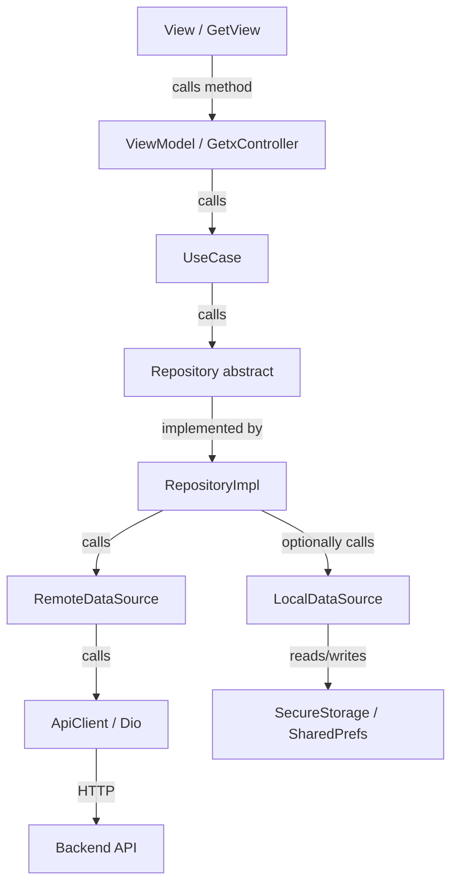

fg # Design Document

## Zoovana CMS — Enterprise Flutter Architecture Scaffold

---

## Overview

The Zoovana CMS app is an enterprise-grade Flutter content management system for managing a marketplace's vendors, products, orders, invoices, payments, and related operations. The project currently contains only a default Flutter counter app. This design covers the complete transformation from that blank slate into a production-ready, feature-based Clean Architecture application.

The architecture follows a strict layered data flow:

```
View → ViewModel → UseCase → Repository → DataSource → ApiClient → Backend API
```

Each layer has a single responsibility and communicates with adjacent layers only through typed contracts. No layer skips another. The first fully implemented feature is **Products** (full CRUD, pagination, image upload, status management). Auth, Dashboard, Vendors, and VendorSites are scaffolded with the correct structure but contain placeholder implementations.

**Technology stack:**
- Flutter (Dart, null-safe)
- GetX `^4.7.3` — state management, routing, dependency injection
- Dio `^5.4.0` — HTTP client
- `flutter_secure_storage ^10.0.0` — auth token storage
- `shared_preferences ^2.2.2` — non-sensitive preferences
- `connectivity_plus ^6.1.4` — network state monitoring
- `flutter_screenutil ^5.9.0` — responsive layout
- `google_fonts ^6.1.0` — typography
- `intl ^0.20.2` — date/number formatting
- `logger ^2.0.2` — structured logging

---

## Architecture

### Layered Data Flow



### Folder Structure

```
lib/
├── main.dart                          # Entry point — calls DI.init() then runApp
├── app.dart                           # GetMaterialApp root widget
│
├── core/
│   ├── config/
│   │   ├── app_config.dart            # Environment config (baseUrl, env name)
│   │   ├── app_env.dart               # Enum: dev / staging / prod
│   │   ├── app_assets.dart            # Asset path constants
│   │   ├── app_colors.dart            # Color constants
│   │   ├── app_strings.dart           # String constants
│   │   └── app_text_styles.dart       # TextStyle constants
│   │
│   ├── network/
│   │   ├── api_client.dart            # Dio wrapper (GetxService)
│   │   ├── api_endpoints.dart         # All URL path constants
│   │   ├── api_response.dart          # Generic API response wrapper
│   │   ├── api_error_handler.dart     # Maps DioException → Failure
│   │   └── interceptors/
│   │       ├── auth_interceptor.dart  # Injects Bearer token
│   │       ├── logging_interceptor.dart
│   │       └── error_interceptor.dart # Converts errors to Failure
│   │
│   ├── error/
│   │   ├── exceptions.dart            # NetworkException, ServerException, CacheException
│   │   ├── failures.dart              # Failure class
│   │   └── result.dart                # Result<T> with success/failure factories
│   │
│   ├── storage/
│   │   ├── secure_storage_service.dart
│   │   └── local_storage_service.dart
│   │
│   ├── services/
│   │   ├── connectivity_service.dart
│   │   ├── permission_service.dart
│   │   └── notification_service.dart
│   │
│   ├── utils/
│   │   ├── validators.dart
│   │   ├── date_time_utils.dart
│   │   └── app_logger.dart
│   │
│   └── di/
│       └── dependency_injection.dart
│
├── shared/
│   ├── widgets/
│   │   ├── app_button.dart
│   │   ├── app_text_field.dart
│   │   ├── app_loader.dart
│   │   └── app_empty_state.dart
│   ├── models/
│   │   └── pagination_model.dart
│   └── extensions/
│       ├── context_extension.dart
│       └── string_extension.dart
│
├── routes/
│   ├── app_routes.dart
│   └── app_pages.dart
│
└── features/
    ├── auth/
    │   ├── data/
    │   │   ├── datasources/auth_remote_datasource.dart
    │   │   ├── models/login_request_model.dart
    │   │   ├── models/login_response_model.dart
    │   │   └── repositories/auth_repository_impl.dart
    │   ├── domain/
    │   │   ├── entities/user_entity.dart
    │   │   ├── repositories/auth_repository.dart
    │   │   └── usecases/login_usecase.dart
    │   │                logout_usecase.dart
    │   └── presentation/
    │       ├── bindings/auth_binding.dart
    │       ├── viewmodels/login_viewmodel.dart
    │       ├── views/login_view.dart
    │       └── widgets/login_form.dart
    │
    ├── dashboard/
    │   ├── data/ (placeholder)
    │   ├── domain/ (placeholder)
    │   └── presentation/
    │       ├── bindings/dashboard_binding.dart
    │       ├── viewmodels/dashboard_viewmodel.dart
    │       └── views/dashboard_view.dart
    │
    ├── products/
    │   ├── data/
    │   │   ├── datasources/product_remote_datasource.dart
    │   │   ├── models/product_model.dart
    │   │   └── repositories/product_repository_impl.dart
    │   ├── domain/
    │   │   ├── entities/product_entity.dart
    │   │   ├── repositories/product_repository.dart
    │   │   └── usecases/
    │   │       ├── get_products_usecase.dart
    │   │       ├── get_product_by_id_usecase.dart
    │   │       ├── create_product_usecase.dart
    │   │       ├── update_product_usecase.dart
    │   │       ├── delete_product_usecase.dart
    │   │       ├── upload_product_image_usecase.dart
    │   │       └── update_product_status_usecase.dart
    │   └── presentation/
    │       ├── bindings/product_binding.dart
    │       ├── viewmodels/product_viewmodel.dart
    │       ├── views/
    │       │   ├── product_list_view.dart
    │       │   ├── product_detail_view.dart
    │       │   └── product_form_view.dart
    │       └── widgets/
    │           ├── product_list_item.dart
    │           └── product_status_badge.dart
    │
    ├── vendors/
    │   ├── data/ (placeholder)
    │   ├── domain/
    │   │   └── entities/vendor_entity.dart
    │   └── presentation/
    │       ├── bindings/vendor_binding.dart
    │       ├── viewmodels/vendor_viewmodel.dart
    │       └── views/vendor_list_view.dart
    │
    └── vendor_sites/
        ├── data/ (placeholder)
        ├── domain/
        │   └── entities/vendor_site_entity.dart
        └── presentation/
            ├── bindings/vendor_site_binding.dart
            ├── viewmodels/vendor_site_viewmodel.dart
            └── views/vendor_site_list_view.dart
```

### Key Architectural Decisions

**Decision 1: GetX for state, routing, and DI**
GetX provides a unified solution for reactive state (`Rx` observables + `Obx`), named routing with automatic binding invocation, and lazy dependency injection. This avoids the overhead of combining separate packages (e.g., Riverpod + GoRouter + get_it) while keeping the architecture clean.

**Decision 2: Feature-based folder structure over layer-based**
Grouping by feature (`features/products/data/`, `features/products/domain/`) rather than by layer (`data/products/`, `domain/products/`) keeps all code for a feature co-located. This makes it easier to add, remove, or hand off a feature without touching unrelated code.

**Decision 3: Result<T> instead of exceptions or raw maps**
Every repository method returns `Result<T>`. This forces callers to handle both success and failure paths at compile time, eliminates unhandled exceptions propagating to the UI, and makes the data flow explicit.

**Decision 4: Separate Model and Entity**
`ProductModel` lives in the data layer and handles JSON parsing. `ProductEntity` lives in the domain layer and represents the business object. This decouples the app from API response shape changes — if the API renames `product_name` to `name`, only the model changes.

**Decision 5: Feature Bindings for lazy DI**
Each feature registers its own dependencies via a `Bindings` class using `Get.lazyPut`. Dependencies are only instantiated when the route is first accessed, keeping startup time fast. Only truly global services (ApiClient, SecureStorageService, etc.) are registered in `DependencyInjection.init()`.

---

## Components and Interfaces

### Core Network Layer

#### ApiClient

```dart
class ApiClient extends GetxService {
  late final Dio _dio;

  Future<ApiClient> init() async {
    _dio = Dio(BaseOptions(
      baseUrl: ApiEndpoints.baseUrl,
      connectTimeout: const Duration(seconds: 30),
      receiveTimeout: const Duration(seconds: 30),
      headers: {'Content-Type': 'application/json', 'Accept': 'application/json'},
    ));
    _dio.interceptors.addAll([
      AuthInterceptor(Get.find<SecureStorageService>()),
      ErrorInterceptor(),
      LoggingInterceptor(),
    ]);
    return this;
  }

  Future<Response> get(String path, {Map<String, dynamic>? queryParameters});
  Future<Response> post(String path, {dynamic data, Map<String, dynamic>? queryParameters});
  Future<Response> put(String path, {dynamic data});
  Future<Response> patch(String path, {dynamic data});
  Future<Response> delete(String path);
}
```

#### AuthInterceptor

Reads the token from `SecureStorageService` on every request and injects `Authorization: Bearer <token>`. On HTTP 401, clears the stored token and redirects to `AppRoutes.login`.

#### ErrorInterceptor

Catches `DioException` and converts it to a typed `Failure`. Maps `DioExceptionType.connectionTimeout` and `DioExceptionType.receiveTimeout` to `NetworkException`. Maps HTTP 4xx/5xx to `ServerException` with the status code.

### Core Error Types

```dart
// core/error/result.dart
class Result<T> {
  final T? data;
  final Failure? failure;

  const Result._({this.data, this.failure});

  factory Result.success(T data) => Result._(data: data);
  factory Result.failure(Failure failure) => Result._(failure: failure);

  bool get isSuccess => failure == null;

  R when<R>({
    required R Function(T data) success,
    required R Function(Failure failure) failure,
  });
}

// core/error/failures.dart
class Failure {
  final String message;
  final int? statusCode;
  const Failure({required this.message, this.statusCode});
}

// core/error/exceptions.dart
class NetworkException implements Exception { final String message; }
class ServerException implements Exception { final String message; final int statusCode; }
class CacheException implements Exception { final String message; }
```

### Core Storage Services

```dart
// SecureStorageService
abstract class SecureStorageService {
  Future<void> writeToken(String token);
  Future<String?> readToken();
  Future<void> deleteToken();
}

// LocalStorageService
abstract class LocalStorageService {
  Future<String?> getString(String key);
  Future<void> setString(String key, String value);
  Future<bool?> getBool(String key);
  Future<void> setBool(String key, bool value);
  Future<void> remove(String key);
  Future<void> clear();
}
```

### Routing

```dart
// routes/app_routes.dart
class AppRoutes {
  static const String splash    = '/splash';
  static const String login     = '/login';
  static const String dashboard = '/dashboard';
  static const String products  = '/products';
  static const String productDetail = '/products/detail';
  static const String productForm   = '/products/form';
  static const String vendors       = '/vendors';
  static const String vendorSites   = '/vendor-sites';
  static const String settings      = '/settings';
}

// routes/app_pages.dart — maps each route to View + Binding
class AppPages {
  static final pages = [
    GetPage(name: AppRoutes.login,     page: () => const LoginView(),        binding: AuthBinding()),
    GetPage(name: AppRoutes.dashboard, page: () => const DashboardView(),    binding: DashboardBinding()),
    GetPage(name: AppRoutes.products,  page: () => const ProductListView(),  binding: ProductBinding()),
    // ... etc
  ];
}
```

### Products Feature — Domain Interfaces

```dart
// domain/repositories/product_repository.dart
abstract class ProductRepository {
  Future<Result<List<ProductEntity>>> getProducts({int page = 1});
  Future<Result<ProductEntity>> getProductById(String id);
  Future<Result<ProductEntity>> createProduct(ProductEntity product);
  Future<Result<ProductEntity>> updateProduct(ProductEntity product);
  Future<Result<void>> deleteProduct(String id);
  Future<Result<String>> uploadProductImage(String id, String filePath);
  Future<Result<ProductEntity>> updateProductStatus(String id, ProductStatus status);
}
```

### Products Feature — ViewModel Interface

```dart
class ProductViewModel extends GetxController {
  // Observables
  final products    = <ProductEntity>[].obs;
  final isLoading   = false.obs;
  final errorMessage = ''.obs;
  final currentPage = 1.obs;
  final lastPage    = 1.obs;

  // Methods
  Future<void> fetchProducts();
  Future<void> fetchNextPage();
  Future<void> fetchProductById(String id);
  Future<void> createProduct(ProductEntity entity);
  Future<void> updateProduct(ProductEntity entity);
  Future<void> deleteProduct(String id);
  Future<void> uploadImage(String id, String filePath);
  Future<void> updateStatus(String id, ProductStatus status);
}
```

### Shared Widgets

| Widget | Props | Purpose |
|---|---|---|
| `AppButton` | `label`, `onPressed`, `isLoading` | Primary action button with loading state |
| `AppTextField` | `label`, `hint`, `controller`, `validator`, `obscureText` | Styled form input |
| `AppLoader` | — | Centered `CircularProgressIndicator` |
| `AppEmptyState` | `message`, `icon?` | Empty list / no-data placeholder |

### Shared Models

```dart
// shared/models/pagination_model.dart
class PaginationModel {
  final int currentPage;
  final int lastPage;
  final int total;
  final int perPage;

  factory PaginationModel.fromJson(Map<String, dynamic> json);
}
```

---

## Data Models

### ProductEntity (domain layer)

```dart
enum ProductStatus { active, inactive, draft }

class ProductEntity {
  final String id;
  final String name;
  final String description;
  final double price;
  final ProductStatus status;
  final String categoryId;
  final String vendorId;
  final String? imageUrl;
}
```

### ProductModel (data layer)

```dart
class ProductModel {
  // All fields from API response
  factory ProductModel.fromJson(Map<String, dynamic> json);
  ProductEntity toEntity();
}
```

### UserEntity (domain layer)

```dart
class UserEntity {
  final String id;
  final String name;
  final String email;
  final String token;
}
```

### LoginResponseModel (data layer)

```dart
class LoginResponseModel {
  factory LoginResponseModel.fromJson(Map<String, dynamic> json);
  UserEntity toEntity();
}
```

### VendorEntity (domain layer)

```dart
class VendorEntity {
  final String id;
  final String name;
  final String email;
  final String status;
  final DateTime createdAt;
}
```

### VendorSiteEntity (domain layer)

```dart
class VendorSiteEntity {
  final String id;
  final String vendorId;
  final String name;
  final String address;
  final String status;
}
```

### PaginationModel (shared)

```dart
class PaginationModel {
  final int currentPage;
  final int lastPage;
  final int total;
  final int perPage;
}
```

---

## Correctness Properties

*A property is a characteristic or behavior that should hold true across all valid executions of a system — essentially, a formal statement about what the system should do. Properties serve as the bridge between human-readable specifications and machine-verifiable correctness guarantees.*

### Property 1: Result exhaustiveness

*For any* `Result<T>`, calling `when(success:, failure:)` must invoke exactly one of the two callbacks — never both, never neither.

**Validates: Requirements 4.1, 4.2**

---

### Property 2: Model-to-entity round trip

*For any* valid `ProductModel` constructed from a JSON map, calling `toEntity()` and then reading each field must produce values equal to those in the original JSON map (after type coercion).

**Validates: Requirements 12.3, 12.4**

---

### Property 3: LoginResponseModel-to-entity round trip

*For any* valid `LoginResponseModel` constructed from a JSON map, calling `toEntity()` must produce a `UserEntity` whose `id`, `name`, `email`, and `token` fields match the source JSON.

**Validates: Requirements 11.2, 11.3**

---

### Property 4: PaginationModel round trip

*For any* valid pagination JSON object with `currentPage`, `lastPage`, `total`, and `perPage` fields, `PaginationModel.fromJson(json)` must parse all four fields correctly.

**Validates: Requirements 9.5**

---

### Property 5: Validator rejects blank inputs

*For any* string composed entirely of whitespace characters (including the empty string), the `Validators.required` method must return a non-null error string.

**Validates: Requirements 7.6, 11.11, 14.6**

---

### Property 6: Validator accepts valid email

*For any* string matching the standard email format `local@domain.tld`, `Validators.email` must return `null` (valid). *For any* string that does not match this format, it must return a non-null error string.

**Validates: Requirements 7.6**

---

### Property 7: Successful repository result wraps entity

*For any* successful `ProductRepositoryImpl.getProducts` call (with a mocked data source returning valid models), the returned `Result` must be a success result whose `data` list length equals the number of models returned by the data source.

**Validates: Requirements 4.5, 12.1, 12.2**

---

### Property 8: Failed repository result wraps failure

*For any* `ProductRepositoryImpl` operation where the data source throws an exception, the returned `Result` must be a failure result with a non-empty `message` and the `data` field must be null.

**Validates: Requirements 4.6, 15.3**

---

## Error Handling

### Network Errors

The `ErrorInterceptor` intercepts all `DioException` instances before they reach the repository:

- `DioExceptionType.connectionTimeout` / `receiveTimeout` → `NetworkException` with a user-friendly message
- HTTP 401 → `AuthInterceptor` clears the token and redirects to login; the request is not retried
- HTTP 4xx → `ServerException(message: responseBody.message, statusCode: code)`
- HTTP 5xx → `ServerException(message: 'Server error', statusCode: code)`
- No internet (detected by `ConnectivityService`) → `NetworkException('No internet connection')`

### Repository Error Handling

Every `RepositoryImpl` wraps its data source call in a `try/catch`:

```dart
try {
  final models = await remoteDataSource.getProducts(page: page);
  return Result.success(models.map((m) => m.toEntity()).toList());
} on NetworkException catch (e) {
  return Result.failure(Failure(message: e.message));
} on ServerException catch (e) {
  return Result.failure(Failure(message: e.message, statusCode: e.statusCode));
} catch (e) {
  return Result.failure(Failure(message: e.toString()));
}
```

### ViewModel Error Handling

ViewModels expose an `errorMessage` observable. On failure, they set `errorMessage.value = failure.message` and set `isLoading.value = false`. Views observe `errorMessage` and display it in a `SnackBar` or inline error widget.

### Form Validation

Form views use Flutter's built-in `Form` + `TextFormField` with `validator` callbacks. The `Validators` utility class provides reusable validators. Form submission is blocked client-side if validation fails — no UseCase is called.

---

## Testing Strategy

### Overview

This architecture uses a **dual testing approach**:
- **Unit tests** for specific examples, edge cases, and error conditions
- **Property-based tests** for universal properties across all inputs

Property-based testing is applied to the pure logic components: `Result<T>`, model serialization, validators, and repository logic (with mocked data sources). It is **not** applied to UI rendering, routing configuration, or DI wiring.

**PBT library:** [`dart_test` + `fast_check` (Dart port)](https://pub.dev/packages/fast_check) or the `test` package with manual generators. Minimum **100 iterations** per property test.

### Unit Tests

**Core error types (`core/error/`)**
- `Result.success` stores data and `isSuccess` is true
- `Result.failure` stores failure and `isSuccess` is false
- `Result.when` calls the correct callback

**Validators (`core/utils/validators.dart`)**
- `required` returns error for empty string, null, whitespace-only
- `email` returns null for valid emails, error for invalid
- `phone` returns null for valid phone numbers, error for invalid

**Model parsing (`features/*/data/models/`)**
- `ProductModel.fromJson` correctly maps all fields
- `ProductModel.toEntity()` produces correct `ProductEntity`
- `LoginResponseModel.fromJson` + `toEntity()` round trip
- `PaginationModel.fromJson` parses all four fields

**Repository implementations (mocked data sources)**
- Success path: data source returns models → repository returns `Result.success(entities)`
- Failure path: data source throws → repository returns `Result.failure(Failure(...))`

**ViewModel logic (mocked use cases)**
- `fetchProducts` sets `isLoading` true then false
- On success: `products` list is populated
- On failure: `errorMessage` is set, `products` unchanged
- Pagination: `fetchNextPage` only called when `currentPage < lastPage`

### Property-Based Tests

Each property test must include a comment tag:
`// Feature: zoovana-cms-architecture, Property N: <property_text>`

Minimum 100 iterations per test.

| Property | What varies | What is verified |
|---|---|---|
| P1: Result exhaustiveness | Any `Result<T>` (success or failure) | `when` calls exactly one callback |
| P2: ProductModel round trip | Random product JSON maps | `fromJson → toEntity` field equality |
| P3: LoginResponseModel round trip | Random login response JSON maps | `fromJson → toEntity` field equality |
| P4: PaginationModel round trip | Random pagination JSON maps | All four fields parsed correctly |
| P5: Validator rejects blank | Whitespace-only strings of varying length | `required` returns non-null error |
| P6: Validator email | Valid and invalid email strings | Correct null/non-null return |
| P7: Repository success wraps entity | Random lists of valid models (mocked) | Result is success, length matches |
| P8: Repository failure wraps failure | Data source throws various exceptions | Result is failure, message non-empty |

### Integration Tests

- `ApiClient` initializes with correct base URL and headers
- `AuthInterceptor` injects token from `SecureStorageService`
- `AuthInterceptor` redirects to login on 401
- `DependencyInjection.init()` registers all global services without error
- Route navigation triggers the correct `Binding`

### What is NOT tested with PBT

- UI rendering (Views, Widgets) — use widget tests with `flutter_test`
- Routing configuration — use example-based integration tests
- DI wiring — use smoke tests (single execution)
- `ConnectivityService` reactive state — use mock stream tests
